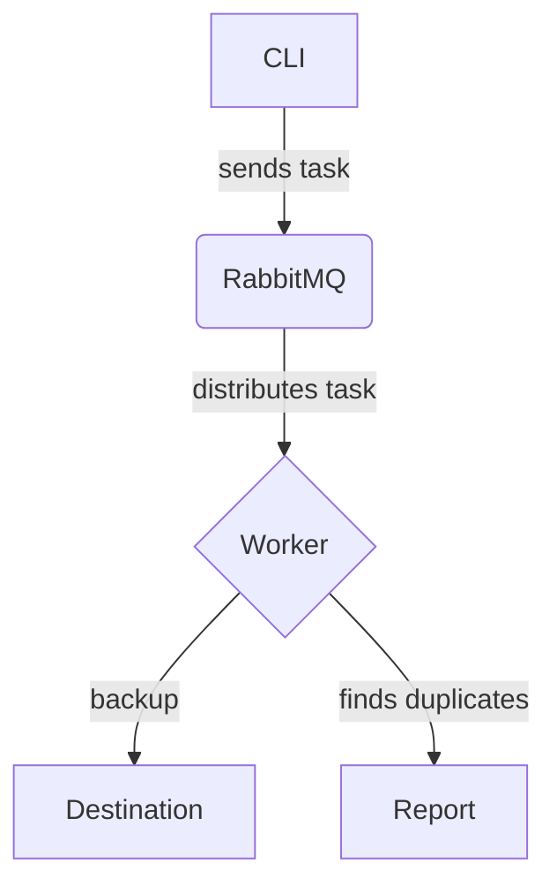

# My Drive Manager System Archtecture

This project is a command-line tool designed to manage and back up files, with a special focus on photos and videos. It uses a message-oriented architecture to handle tasks asynchronously, making it scalable and resilient.

## Architecture Overview

Here's a breakdown of the architecture:

### System Components

- **CLI (Command-Line Interface):** The main entry point for users. It allows users to initiate tasks like starting a backup or finding duplicate files.
- **Message Queue (RabbitMQ):** The core of the asynchronous architecture. When a task is initiated via the CLI, a message is sent to a RabbitMQ queue. This decouples the task submission from the actual processing.
- **Workers:** These are Python processes that consume messages from the queue. Each worker is responsible for a specific task, such as:

  - **File Indexing:** Scanning directories and adding files to the processing queue.
  - **Photo/Video Backup:** Moving files from an origin to a destination, potentially organizing them by date.
  - **Duplicate Detection:** Analyzing files to find and flag duplicates.

### Features

- **Asynchronous Backup:** Backups are handled in the background, allowing the user to continue using the terminal.
- **Photo and Video Organization:** The system can organize backed-up files into a structured directory format (e.g., by year, month, and day).
- **Duplicate File Detection:** It includes a feature to identify and report duplicate photos and videos, helping to save storage space.

### Technology Stack

- **Programming Language:** Python 3.12+
- **Asynchronous Messaging:** `aio-pika` for interacting with RabbitMQ.
- **Image Processing:** `Pillow` for handling image files.
- **Video Processing:** `ffmpeg-python` for processing video files.
- **Containerization:** Docker and Docker Compose are used to create a consistent and isolated environment for the application and its services, like RabbitMQ.
- **Dependency Management:** `uv` is used to manage Python dependencies.

### Backend

### Source Code Structure

The project's source code is organized within the `src/` directory as follows:

- **`entry/`**: Contains the application's starting points, such as CLI functions.
  - `[command_cli_name]`: Each subdirectory represents a specific cli command.
- **`feature/`**: Houses the business implementation.
  - `[feature_name]/`: Each subdirectory represents a specific feature.
    - `domain`: Contains the core business logic and rules.
        - `business`: Implements the specific business workflows and use cases.
        - `entities`: Defines the core business objects and data structures.
        - `repositories`: Declares the interfaces for data access and persistence.
    - `infrastructure`: Provides the technical implementation of the domain's interfaces.
        - `drivers`: Contains the concrete implementation of repositories, interacting with databases, APIs, or the file system.
            - `[implementation_drive_name]`: A specific driver implementation.
        - `layers`: Holds abstractions for the drivers.
            - `[abstraction_drive_name]`: A specific driver abstraction.
    - `presentation`: Handles the user interface and interaction, such as CLI commands or API endpoints.
- **`shared/`**: Contains all common code shared between layers, replicating the same internal structure.