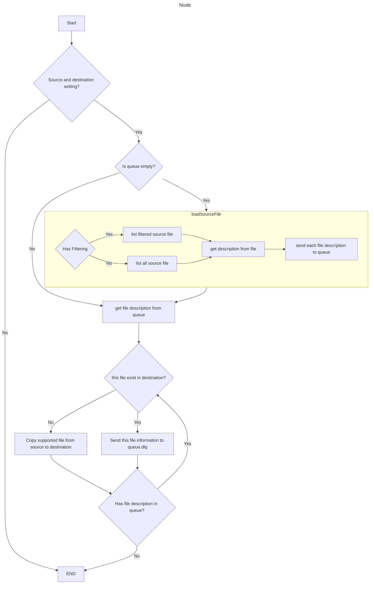

# Backup Photos from Cloud Drives

This feature allows you to back up photos from cloud drives (like Google Drive or iCloud Drive) to a local storage device (like an external hard drive).

## Functionality

*   **Source Selection:**  Allows the user to select a mounted cloud drive as the source.
*   **Destination Selection:** Allows the user to select a local drive as the destination.
*   **File Copying:** Copies photo files (e.g., .jpg, .png, .heic) from the source to the destination.
*   **Directory Structure by Date:** Organizes photos into folders based on the date they were taken (YEAR/MONTH/DAY).
*   **Progress Indication:** Provides feedback on the progress of the backup process.
*   **Error Handling:** Handles potential errors, such as insufficient disk space or file access issues.
* **File Filtering:** Filter files by extension.
* **File Overwrite:** Option to overwrite files or skip.

## Usage

1.  Connect the external hard drive to your computer.
2.  Mount the cloud drive (e.g., Google Drive, iCloud Drive).
3.  Open the application.
4.  Select the mounted cloud drive as the source.
5.  Select the external hard drive as the destination.
6.  Start the backup process.

## Supported Cloud Drives

*   iCloud Drive
*   Google Drive
*   Dropbox
*   OneDrive
*   Any other drive that can be mounted as a local drive.

## Supported File Types

*   .jpg
*   .jpeg
*   .png
*   .heic
*   .gif
*   .tiff
*   .raw
*   and others.

> ## Tasks

```Feature
Feature: Backup Photos from Cloud Drives.

    As a user, I want to backup my photos from cloud drives to a local drive.
    As a user, I want to filter files by extension.
    As a user, I want to overwrite files or skip.
    As a user, I want to be informed if there is not enough space in the destination drive.
    As a user, I want to be informed if some file can not be read.
    As a user, I want the system to use a queue to organize each file copy operation to maintain resilience and allow for a restart if an error occurs.


    Scenario: Backup photos with basic functionality
        Given a mounted cloud drive at "/path/to/cloud/drive"
        And a local drive at "/path/to/destination/drive"
        And the user set "/path/to/cloud/drive" as the source in environment 
        And the user set "/path/to/destination/drive" as the destination in environment
        When the user starts the backup process     
        Then the system should copy all supported photo files from "/path/to/cloud/drive" to "/path/to/destination/drive"
        And the system should organize the copied photos into folders by YEAR/MONTH/DAY
        And the system should provide progress feedback to the user
        And the system should handle any errors during the copy process

    Scenario: Backup photos with file filtering
        Given a mounted cloud drive at "/path/to/cloud/drive"
        And a local drive at "/path/to/destination/drive"
        And the user selects "/path/to/cloud/drive" as the source
        And the user selects "/path/to/destination/drive" as the destination
        And the user filters for files with extension ".jpg"
        When the user starts the backup process
        Then the system should copy only .jpg files from "/path/to/cloud/drive" to "/path/to/destination/drive"
        And the system should organize the copied photos into folders by YEAR/MONTH/DAY
        And the system should provide progress feedback to the user
        And the system should handle any errors during the copy process
        
    Scenario: Backup photos with file overwrite
        Given a mounted cloud drive at "/path/to/cloud/drive"
        And a local drive at "/path/to/destination/drive"
        And the user selects "/path/to/cloud/drive" as the source
        And the user selects "/path/to/destination/drive" as the destination
        And a file "photo.jpg" exists in both the source and destination
        And the user selects the "overwrite" option
        When the user starts the backup process
        Then the system should overwrite the existing "photo.jpg" in the destination
        And the system should organize the copied photos into folders by YEAR/MONTH/DAY
        And the system should provide progress feedback to the user
        And the system should handle any errors during the copy process

    Scenario: Backup photos with file skip
        Given a mounted cloud drive at "/path/to/cloud/drive"
        And a local drive at "/path/to/destination/drive"
        And the user selects "/path/to/cloud/drive" as the source
        And the user selects "/path/to/destination/drive" as the destination
        And a file "photo.jpg" exists in both the source and destination
        And the user selects the "skip" option
        When the user starts the backup process
        Then the system should skip copying the existing "photo.jpg" in the destination
        And the system should organize the copied photos into folders by YEAR/MONTH/DAY
        And the system should provide progress feedback to the user
        And the system should handle any errors during the copy process
    
    Scenario: Handle insufficient disk space
        Given a mounted cloud drive at "/path/to/cloud/drive"
        And a local drive at "/path/to/destination/drive" with insufficient space
        And the user selects "/path/to/cloud/drive" as the source
        And the user selects "/path/to/destination/drive" as the destination
        When the user starts the backup process
        Then the system should detect the insufficient disk space
        And the system should display an error message to the user
        And the system should stop the backup process
        
    Scenario: Handle file access issues
        Given a mounted cloud drive at "/path/to/cloud/drive"
        And a local drive at "/path/to/destination/drive"
        And a file at "/path/to/cloud/drive/protected.jpg" that cannot be read
        And the user selects "/path/to/cloud/drive" as the source
        And the user selects "/path/to/destination/drive" as the destination
        When the user starts the backup process
        Then the system should detect the file access issue for "/path/to/cloud/drive/protected.jpg"
        And the system should display an error message to the user
        And the system should continue the backup for other files


```
 


## Future Improvements

*   Incremental backups.
*   Scheduling backups.
*   More detailed error reporting.
*   Support for other file types.
*   Support for other cloud services.
